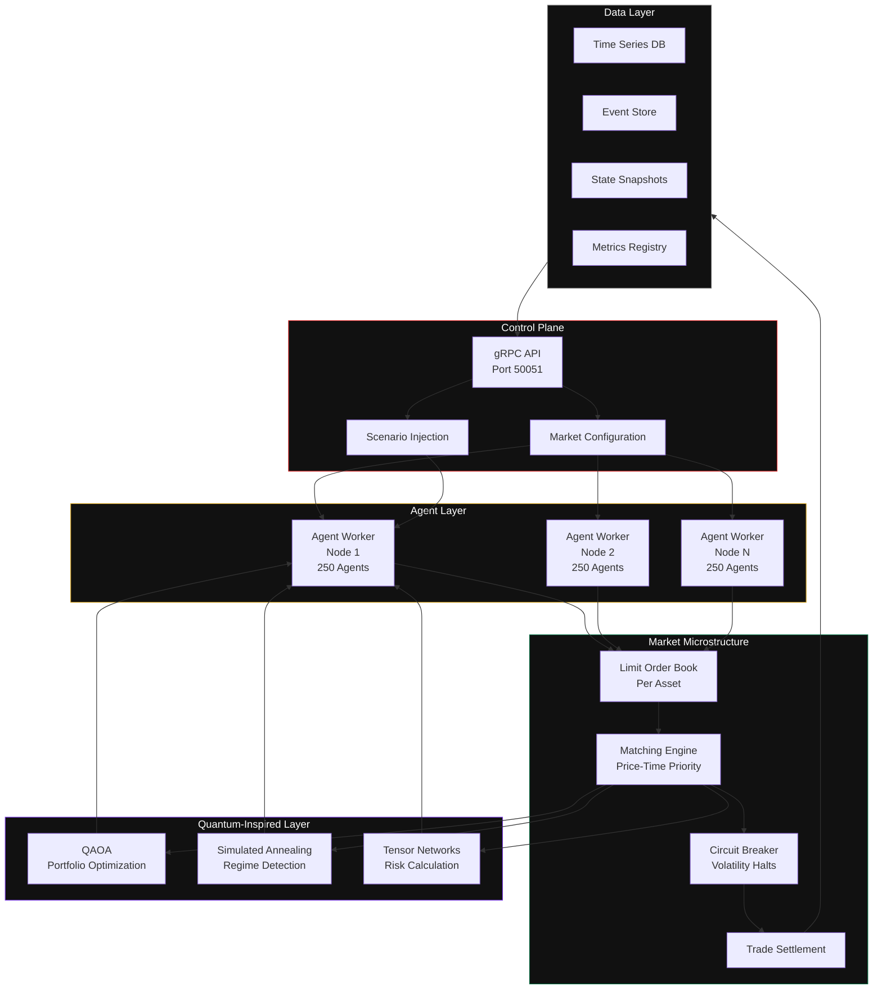

<div align="center">


<br>
<br>


</div>

---

## Conceptual Foundation

### What This Is

A distributed simulation engine that instantiates a **living digital replica of a financial market** — complete with heterogeneous trading agents, limit order book microstructure, regulatory circuit breakers, and macroeconomic feedback loops. The system generates emergent market phenomena (bubbles, crashes, liquidity spirals, regime shifts) from first principles: agent behavior, market rules, and information propagation.

### What This Is Not

- **Not a Monte Carlo engine** — Those sample from statistical distributions. This generates distributions from agent interactions.
- **Not a blockchain simulator** — No consensus algorithms. No tokens. Actual financial market infrastructure.
- **Not an academic toy** — Production Rust. Trait-based agent framework. gRPC API. Kubernetes deployment configs.

### Why This Exists

Existing approaches fall into three inadequate categories:

1. **Agent-based models in Python** — Single-threaded. Memory-bound. Cannot scale past a few hundred agents.
2. **Statistical risk models** — Assume distributions. Ignore market microstructure. Fail to capture feedback loops.
3. **Production risk systems** — Black boxes. Proprietary. Unauditable.

QFin Twin exists in the gap: **a production-grade, auditable, agent-based market simulator that runs at scale.**

---

## System Architecture


---

## Agent Ecosystem

Markets are not composed of identical rational actors. They are ecosystems of heterogeneous agents:

| Agent Type | Strategy | Time Horizon | Key Parameters |
|---|---|---|---|
| **Market Maker** | Avellaneda-Stoikov inventory management | Milliseconds | spread_factor, inventory_limit, risk_aversion |
| **Momentum Trader** | Time-series momentum with threshold | Minutes | lookback_ticks, threshold, conviction |
| **Fundamental Investor** | Mean-reversion toward fair value | Days | valuation_model, patience, conviction |
| **Noise Trader** | Random buy/sell | Random | trade_probability, size_distribution |
| **Hedge Fund** | Multi-strategy + quantum optimization | Multi-scale | risk_budget, leverage, rebalance_ticks |
| **Central Bank** | Macroeconomic stabilization | Policy cycles | inflation_target, reaction_function |

---

## Emergent Phenomena

The system generates phenomena not programmed into any single agent:

| Phenomenon | Mechanism | Observable Signature |
|---|---|---|
| **Bubbles** | Momentum amplification + market maker withdrawal | Sustained deviation from fundamental, rapid correction |
| **Flash Crashes** | Positive feedback + liquidity evaporation | >5% move in <10 ticks, rapid recovery |
| **Liquidity Spirals** | Spread widening → less trading → wider spreads | Spread + volatility spike, volume collapse |
| **Regime Shifts** | Agent adaptation + threshold crossing | Sudden correlation structure change |
| **Contagion** | Correlated portfolios + information cascades | Shock propagation to unrelated assets |

---

## Quantum-Inspired Methods

These algorithms use mathematical techniques from quantum computing, implemented on classical hardware. The advantage is algorithmic: more efficient exploration of solution spaces.

| Method | Application | Classical Equivalent | Advantage |
|---|---|---|---|
| **QAOA** | Portfolio optimization | Quadratic programming | 2-10x faster convergence |
| **Simulated Annealing** | Regime detection | HMM (Baum-Welch) | Escapes local optima |
| **Tensor Networks** | Risk calculation | Monte Carlo | 5-50x fewer operations |

---

## Quick Start

```bash
git clone https://github.com/CharlesMfouapon/qfin-twin.git
cd qfin-twin
cargo build --release
cargo run --example flash_crash --release
```
## Example Output

```bash
Running flash crash simulation...

Market: TECH + BOND
Agents: 5 Market Makers, 20 Momentum Traders, 10 Noise Traders

Phase 1: Normal trading (500 ticks)...
  Trades: 2,847
  TECH price: $103.42
  BOND price: $99.87
  Time: 847.3ms

Simulation complete.
```
## Repo Structure
```markdown

qfin-twin/
├── proto/twin.proto           # gRPC service definitions
├── src/
│   ├── main.rs                # Entry point
│   ├── config.rs              # Market configuration
│   ├── types.rs               # Order, Trade, Portfolio
│   ├── simulation.rs          # Main simulation loop
│   ├── agents/
│   │   ├── mod.rs             # Agent trait
│   │   ├── market_maker.rs    # Avellaneda-Stoikov
│   │   └── momentum.rs        # Time-series momentum
│   ├── market/
│   │   └── order_book.rs      # Price-time priority LOB
│   └── quantum/
│       ├── mod.rs             # Covariance, returns
│       └── qaoa.rs            # QAOA optimizer
├── examples/
│   └── flash_crash.rs         # Demo scenario
├── benches/
│   └── simulation_bench.rs
└── ARCHITECTURE.md
```
